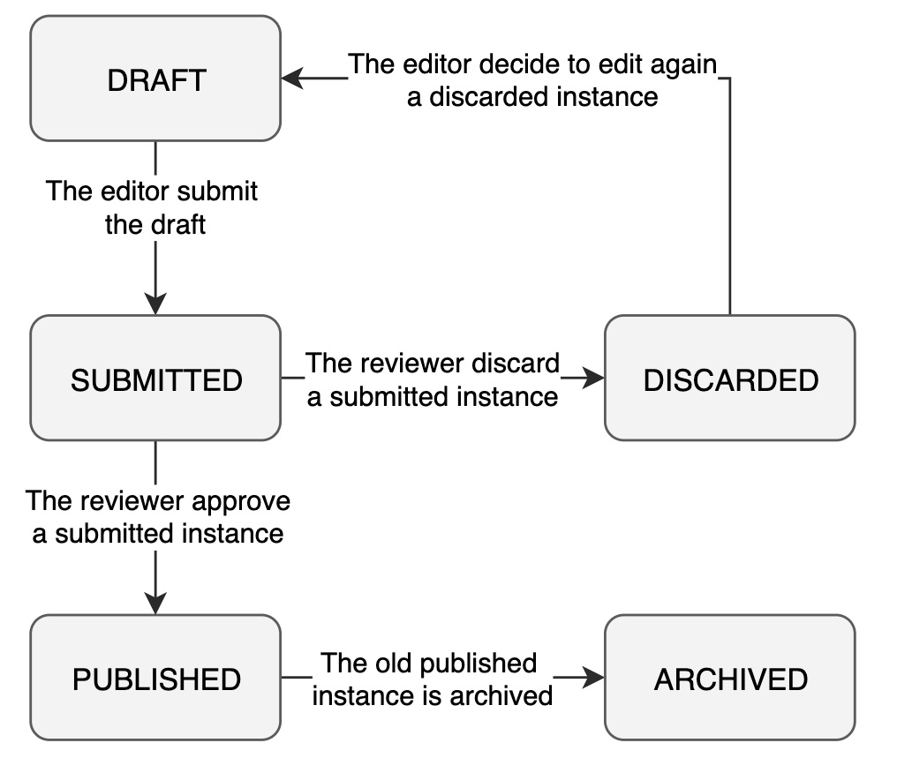
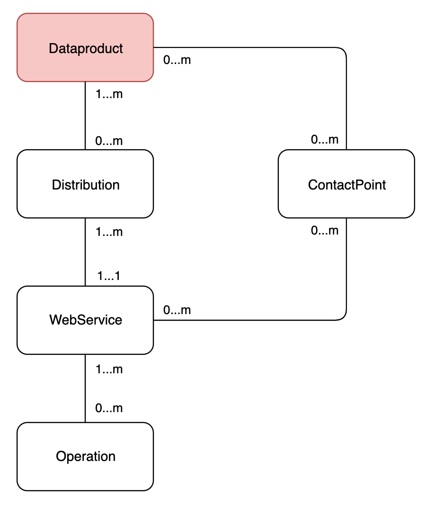
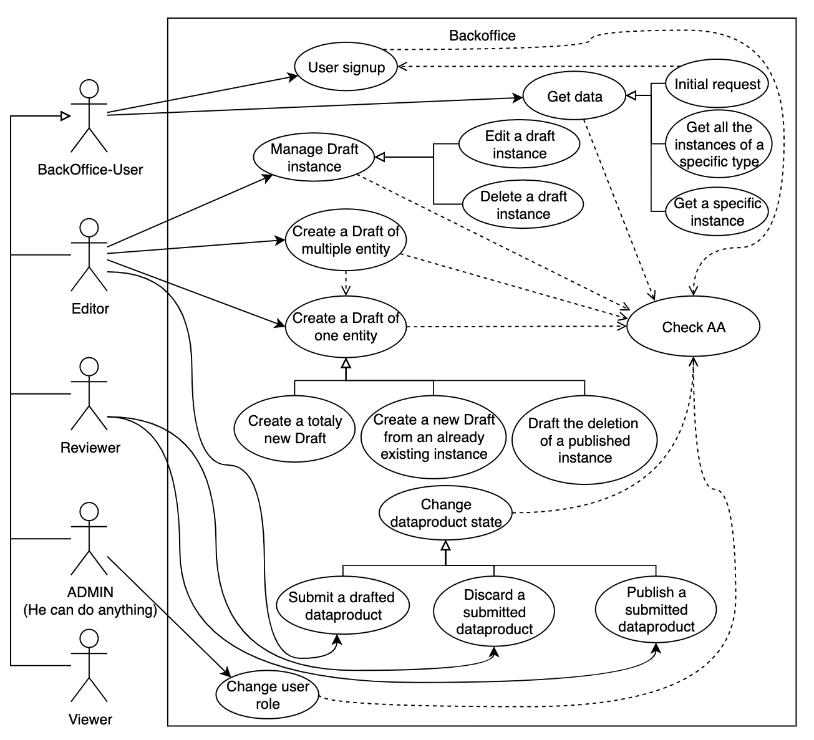

# Concept
We want to improve how the TCSs manage and edit the metadata they produced for the EPOS data portal. At the moment they are used to put all the metadata into the ttl file which are after ingest into the system throught the ingestor-service. They need to operate on these data in a more flexible way. 
At the moment they operate directly on the file hosted on gitlab, this method permits to exploit the git version control in order to keep track of all the change (versioning). Moreover, the possibility to edit the file on gitlab and not directly the database is handy because they use it as a revision system, infact, when a TCS modify the data and commit the change these can be reviewed by other reviewers and also they can see how the new metadata will "look like" on the EPOS Data Portal GUI throught the generation of a new testing environment.
Thanks to the new backoffice the user will be able to only interact with a GUI to create a EPOS Data Model Entity. There is no intention to discontinue the possibility to manage and insert the metadata using the ttl file.

## Glossary
Three different concept will be met in this document multiple time:
1. Instance: is a specific version of a Epos Data Model object. Each instance have its instanceId.
2. Entity: is used to identify a object that can have different version. For the same entity may exist numeros instance with different state, but only one is published. (e.g. can exist five instance of the same entity archived, three draft, two submitted and one published.)
3. Entity Type: is a Epos Data Model different class of objects, an entity type can be a Dataproduct or a Distribution.

## Possible State
Each instance have a specific state:

- **Draft**
	This instance has been edited but not yet submitted. 
- **Submitted**
	This instance needs to be approved in order to be published.
- **Discarded**
	This instance hasn't been approved and is waiting to be edited again.
- **Published**
	This instance is public, and can be seen in the production EPOS DATA PORTAL.
- **Archived**
	This instance is no longer used.

## Role
Every person who interacts with the system is associated to one user.
Every user can have one role for each user group.

- **Viewer**
	The user can only see the information, without being able to modify any of it. He is allowed to visualize the drafted, submitted, discarded and archived data of his group.
- **Editor**
	The user can edit the metadata and create new draft or remove one created by himself. He is allowed to work only on the data of his user group. 
- **Reviewer**
	The user can approve or disapprove a submitted instace. He/she is allowed to make change only on the data of his user group. 
- **Admin**
	The user can do everything.

## User Groups
**Role:** What the user can do.
**Group:** On which data the user can operate with a specific role.

- Each instance belongs to least one Group. 
- Only the users who belong to the same user group as the instance can operate on it.
For example an user group can overlap a TCS, so every entity of a TCS can be modified only by the users that belongs to the that TCS.
Or, another example only selected users can operate on the contract.

### Permission matrix
Type of operation that a user can do:
|               | View | Draft | Submit | Publish | Discard      |
| ------------- | ---------------- | ----------------- | ------------------ | ------------------- | ----- |
| External User |                  |                   |                    |                     |       |
| **Viewer**    | **X**            |                   |                    |                     |       |
| **Editor**    | **X**            | **X**             | **X**              |                     |       |
| **Reviewer**  | **X**            |                   |                    | **X**               | **X** |
| **Admin**     | **X**            | **X**             | **X**              | **X**               | **X** |

These action implicitly refear only to every entity which belong to the same user group as the user.

## Life cycle of an entity


In order to be Published an instance need:
- First the editor draft a new entity or edit an already existing one. The Draft can be edit freely or even remove. (**DRAFT** state)
- When the editor decides that the instance is ok for him/her, he/she submit the entity. (**SUBMITTED** state)
- A reviewer has to take charge and check if the submitted instance is correct. If so, the change will be published. (**PUBLISHED** state) 
 The instance that was previously published is put in an archive to be able in the future to rollback some changes. (**ARCHIVED** state)
- If the reviewer doesn't approve the change, the changes are discarded. (**DISCARDED** state)  An editor can create a new draft from this.



## Assumption 
- In this document are take into account only the scientific metadata entity (see the section [Scientific Metadata and the EPOS Data Model](#scientific-metadata-and-the-epos-data-model)). The entity type which describe other concept (e.g. contract, DataProductImplementationStatus, etc.) are at the moment not considered in this document.
- Every User can have only one Draft instance for each entity. So for each tuple of metaId and editorUserMetaId can exist only one instance marked as draft.
- Even if the user can create a draft for each type of entity, the process of approval is refered to the whole Dataproduct. 

# BackOffice Api Documentation
This section aim to describe the interaction between the backend backoffice API and the GUI. 

## Scientific Metadata and the EPOS Data Model
For scientific metadata exist the following entity type: Dataproduct, Distribution, ContactPoint, WebService, Operation, Mapping. The Relations between these entity are showed in the following image. To better understand the EPOS Data Model see the api-docs of the swagger page of the backoffice-service which show all the specification of all the EDM entities.



## Use Case
A few group of use cases have been identified, for each one there is a short description of when the use case is meant to happen and other general information, then follow a more schematic description of all the action which the user is expected to do, and then a few alternative scenarios that may occour. 



Each request to the backoffice need to pass throught the [1. Check AA](#1-check-aa) use case, in the description of all the other use case this is implicit and it is taken for granted that the user is already identified by the system.

### 1. Check AA
This use case describe how the user is authenticated by the system to also determine its role and its given permissions. This passage is mandatory for every operation done with the system.

**Basic flow** 
1. In the header of the request is passed the access token returned by the AAI in response of the login throught the GUI.
2. The system validate the access token provided and manage to climb back to the eduIdentifier of the user.

**Alteranative flow**
- The access token is not valide: The system return an HTTP Code 401

**Example**
- HTTP Header
``` HTTP Header
Authorization: Bearer <<access_token>>
```

### 2. Get data
This set of use case describe how the user can retrive information from the system.
If the user is trying to first access the backoffice see [2.1 Initial request](#21-initial-request) use case, after that if he want to retrieve all the instances of a specific type see the [2.2 Get all the instances of a specific type](#22-get-all-the-instances-of-a-specific-type) use case and, if he instead want to retrive a specific instance, see [2.3 Get a specific instance](#23-get-a-specific-instance) use case.

#### 2.1 Initial request
This use case describe how the user can retrive an index of the backoffice. Probabily this use case occours every time the user decide to open the backoffice. The user infact doesn't know what kind of information he is authorized to see and what kind of user he is.

**Basic flow**
1. The user request the system the information about himself throught the user endpoint (GET /user/self ) flagging as true the parameter *available_section*.
2. Here we can have two different scenario:
	- The system already know who the user is, the use case can resume at the point 3. 
	- The User is not registered in the system. The request just done return 404. The user need to signup himself in the system following the [6. User signup](#6-user-signup) use case.
3. The system assemble the response including the user information (like email, role... etc.) and a list of the entities types accessible as all by the user (Dataproduct, Person...).  

**User accessible entity type as all related to the user role**
| User Role | Accessible entity type list   |
| --------- | ----------------------------- |
| Viewer    | D                             |
| Editor    | D                             |
| Rewiever  | D, O, P                       |
| Admin     | D, O, P, U, D, W, Op, SA, SC  |

D: DataProduct, O: Organization, P: Person, U: User, D: Distribution, W: Webservice, Op: Operation, SA: Software Application, SC: Software Source Code

#### 2.2 Get all the instances of a specific type
This use case describe how the user can see all the existing instances of a specific enitity type. For example the user follow this use case when he want to navigate throught the different entity type accessible as a all returned in response after the initial request.

**Basic Flow**
1. The user can retrieve the data about a specific type of entities using the specific endpoint for each resource (GET /{entity_type}/all, e.g. GET /dataproduct/all). 
2. In the response he have the list of all the instances he have the permission to see.

**Alteranative flow**
- The entityType Id doesn't exist: returned 404 code.
- There aren't entity of that type viewable by the user: 204 http code

**Accessible instance based on the status, group, and user role**
| User Role | Published | Draft                        | Submitted                                               | Discarded                   | Archived               |
| --------- | --------- | ---------------------------- | ------------------------------------------------------- | --------------------------- | ---------------------- |
| Viewer    | All       | Nothing                      | Nothing                                                 | Nothing                     | The ones of his groups |
| Editor    | All       | Only the one he is the autor | Only the one he is the author and the one of his groups | Only the ones of his groups | The ones of his groups |
| Reviewer  | All       | Nothing                      | Only the ones of his groups                             | Only the ones he discarded  | The ones of his groups |
| Admin     | All       | All                          | All                                                     | All                         | All                    |

#### 2.3 Get a specific instance
This use case describe the how the user can se a specific instance and access all the details of this.

**Basic flow**
1. The user request the specific instance using the endpoint responsible of that entity type (GET /{entity_type}/{instance_id} e.g. GET /dataproduct/abcd-1234-zyxw-0987).
2. In the response is present the json of that entity. Where there is a relation with another instance there is a json object with the following structure:
```json
{
	uid: "epos/example/distribution/uid", // The uid of the instance target of the relation, the business identifier chosen by the TCS
	instanceId: "qwer-1234-asdf-5678", // The InstanceId target of the relation the id of that record
	metaId: "aaaa-bbbb-1111-2222", // The metaId of the instace target of the relation the id which refear to all the different version/status of a specific entity
	entityType: "Distribution" // The type of the instance target of the relation, e.g. Distribution, ContactPoint...
}
```
3. If the user want to explore also the related instance he can restart this use case using the instanceId found in the relation .

**Alteranative flow**
- The instance Id doesn't exist: returned 404 code.
- The user is trying to accessing to a instance that he cannot access: returned 403 code.

### 3. Create a Draft
This set of use case describe how the user is able to create a new draft. It doen't matter which type of scientific metadata the user is trying to draft, the flow will be the same. 

**Basic flow**
1. The user have a new instance to save as DRAFT:
	- the fields: `instanceId`, `timestamp`, `editorUserMetaId` can be left blank
	- the fields: `changeComment` and `version`, can be populated with the comment of the user on the DRAFT
	- If the related instance doesn't already exist in the json object with the relation only the uid have to be setted, the system will figure out later the right instanceId.
2. The user make a POST request on the endpoint (POST /{instance_type_name}, e.g. POST /distribution) with the instance to be drafted in the body.
3. The user have in response the `instanceId` of the drafted dataproduct, even when the new instance is not a distribution is returned the instanceId of the dataproduct which contains the drafted instance. The user can see all the instance related to the dataproduct instance with that instance with the use case [2.3 Get a specific instance](#23-get-a-specific-instance).

**Alteranative flow**
- The instance is not formatted correctly: returned 400 code.
- The status of the instance is not Draft: return 403 code.

#### 3.1. Create a totaly new instances as draft
This particolar use case happen when the user is trying to create a draft of a new entity, this means that in the system there aren't any instance this entity. 

**Basic flow**
The new instance will have the fields `metaId` and `parentInstanceId` blank. The basic flow here is the same described in the section [3. Create a Draft](#3-create-a-draft).

#### 3.2. Create a new instances as draft from an already existing instances
This particolar use case happen when the user is trying to create a draft of an already existing entity, this means that in the system there is a instance of that entity already.  This also means that when (and if) this instance will be published it will take the place of the older one instance of that entity published.

**Basic flow**
The new instance have the field `metaId` set equal to the `metaId` of the original starting instance, at the same time the `instanceId` of the starting instance is used in the `parentInstanceId` of the new draft instance. The basic flow described in use case [3. Create a Draft](#3-create-a-draft) is also valid here.

**Alteranative flow**
- The user have already a draft for that metaId: return 409 code.

#### 3.3. Draft the deletion of a published instance
This particolar use case happen when the user is trying to delete a published instance. The process of approval for the deletion of a published instance is the same to approve a normal draft. This is reflected also in the creation of a draft for the deletion.

**Basic flow**
1. The user create a draft that have the field `metaId` set equal to the `metaId` of the original starting instance, and the `instanceId` of the starting instance is used in the `parentInstanceId` of the new draft instance, to mark the deletion of the original instance, the user  need to flag `true` the field `toBeDelete`. All the field related to the metadata can be left empty.
2. The system return a instanceId of the Dataproduct to be removed from be published or the Dataproduct which contains, directly or indirectly, the instance to be unpublished.

#### 3.4 Create draft of multiple entity
This use case describe the interaction between the user and the system if the user want to draft multiple entity. All of these instance are intended to be related to only one Dataproduct, the draft of multiple entity that are part of different dataproduct can be resolved by using multiple times the [3. Create a Draft](#3-create-a-draft) use case. Futhermore, the system doesn't care in which order the different instance are drafted, so this use case can be resolved by doing several different request at the same time.

**Basic flow**
1. The user have a set of instance related to the same dataproduct. 
2. For each instances the user follow either the use case [3.1. Create a totaly new set of instances as draft](#31-create-a-totaly-new-set-of-instances-as-draft) or the use case [3.2. Create a new set of instances as draft from an already existing instances](#32-create-a-new-set-of-instances-as-draft-from-an-already-existing-instances), or, if the goal is to delete one or more published entities he can also follow the [3.3. Draft the deletion of a published instance](#33-draft-the-deletion-of-a-published-instance) use case.

**Alteranative flow**
- one or more requests fails: The user have in response an HTTP error code and can do again the request after fixing the instance

### 4. Manage Draft/Discarded Instance
After an editor have created a drafted instance he completely control that instance throught the CRUD Operation offered by the enpoint of that type of instance. If the instance, after being submitted by the editor, was discarded by the reviewer the user is able to manage it as it was his draft.

#### 4.1.  Edit a draft/Discarded Instance
This use case describe how the user and the system interact when he want to modify a draft/discarded already created (by himself).

**Basic flow**
1. The user have the updated drafted version of a draft instance.
2. The user do a PUT request on that instance using the endpoint of that entity type. (e.g. PUT /{entity_type}/{instance_id_of_the_draft})
3. The System return an http Status code andif the instance was marked as Discarded its status is now Draft again.

#### 4.2. Delete Draft/Discarded Instance
This specific use case describe how the user and the system interact when he to delete a draft or a discarded instance.

**Basic flow**
1. The user do a DELETE request on that instance using the endpoint of that entity type. (e.g. DELETE /{entity_type}/{instance_id})
2. The System return an http Status code.

### 5. Change instance state
This set of use case is about of how the user interact with the system to change the state of a instance of Dataproduct, infact, It is worth recalling that the process of approval is refered to the whole Dataproduct.

**Basic flow**
1. The user have the `instanceId` of the instance whose state need to be changed.
2. The user use the endpoint to change the state to (PUT /{entity_type}/{instance_id}/{status})
3.  The response is the HTTP code.

| User Role | Available state       |
| --------- | --------------------- |
| Viewer    |                       |
| Editor    | Draft, Submitted      |
| Rewiever  | Published, Discarded  |
| Admin     | All                   |

**Alternative  flow**
- The user can't do that state change or that instance state can't be changed by that user: HTTP code 403.

#### 5.1. Publish a submitted Dataproduct
The flow of this use case is the same as the 5. Change instance state use case, but only a reviewer can start this use case, the request will be PUT /{entity_type}/{instance_id}/published

#### 5.2. Discard a submitted Dataproduct
The flow of this use case is the same as the 5. Change instance state use case, but only a reviewer can start this use case, the request will be PUT /{entity_type}/{instance_id}/discarded

#### 5.3. Submit a drafted DataProduct
The flow of this use case is the same as the 5. Change instance state use case, but only a editor can start this use case, the request will be PUT /{entity_type}/{instance_id}/submitted

### 6. User signup
This use case describe how the user is able to register himself or another user in the system, in this way the system is able to identifie the user and know which role he have.

**Basic flow**
1. A user to register someone in the system send a POST request to the user enpoint, and in the body, put at least these mandatory attribute showed below in the json:
```json
{
	eduIdentifier: "de02...08@aaai.epos-eu.org",
	email: "ema...il@gmail.com",
	firstName: "name",
	lastName: "surname"
	// Also the user role can be specified, but it will be
	// deemed and used only if the request has been done by an admin.
}
```
2. The user that do the request need to be an admin.
3. The system return a 201 HTTP status code

**Alternative flow**
- The user is already registered in the system: 200 HTTP code

### 7. Change user role
This use case describe how a user can change the role to another user. The user need to be admin.

**Basic flow**
1. The user get all the user as described in the 2.2 Get all the instances of a specific type use case.
2. The user can choose from the list the id of the user who he want to change the role.
3. The user send a PUT request with a json object like this:
```json
{
	role: "ADMIN"
}
``` 
4. The system return a http code.

## Process of approval
The process for the approval of a draft involve severale use cases described above. In this section are described all the step and the sequence of use case that take place to be able to have in place the process of approval. Some included phase are not striclty required but are presented to have a better understanding of the workflow of the users.  The different following subsection identify the operation done by a specific type of user.

**Goal**
A TCS want edit a WebService `description` and its `uid` and also add to it a new Operation (the Operation is not present in the system yet) and at the same time remove an old one. 

### Editor workflow
1. The user try to access the system to knew which type of entities he have access: 2.1 Initial request use case.
2. The user now know he can access the list of Dataproduct from the previous step, so he decide to retrive this list: 2.2 Get all the instances of a specific type use case.
3. The user search for the DataProduct which contain the Distribution that have as WebService of interest from the list and start to see all the information of the its subinstance related to it: 2.3 Get a specific instance use case multiple time for each subinstance.
4. The user edit the Webservice and save it as a new draft instance: [3.2. Create a new set of instances as draft from an already existing instances](#32-create-a-new-set-of-instances-as-draft-from-an-already-existing-instances) use case.
5. The user draft the delection of the old published Operation: [3.3. Draft the deletion of a published instance](#33-draft-the-deletion-of-a-published-instance) use case.
6. The user create the draft of the new Operation: [3.1. Create a totaly new set of instances as draft](#31-create-a-totaly-new-set-of-instances-as-draft) use case.
7. The user create also the draft of the ContactPoint related to the WebService with a different telephone number: [3.2. Create a new set of instances as draft from an already existing instances](#32-create-a-new-set-of-instances-as-draft-from-an-already-existing-instances) use case. 
8. The user is left with a new drafted Dataproduct which contains the new Operation and the modified version of the Webservice. He can check the whole Dataproduct object again: 2.3 Get a specific instance use case.
9. The user is not happy with the result so he edit again the WebService draft: 4.1. Edit a draft Instance use case.
10. Also the user realize that the telephone number of the contactPoint he have just drafted is not changed so he delete the draft: 4.2. Delete Draft Instance use case.
11. The user now is satisfied by the draft outcome so he submit this Dataproduct: 5.3. Submit a drafted DataProduct use case.

### Reviewer workflow
1. The user try to access the system to knew which type of entities he have access: 2.1 Initial request use case.
2. The user know he can access the list of existing Dataproduct from the previous point, so he decide to retrive this list to see if there are any Dataproduct waiting submitted: 2.2 Get all the instances of a specific type use case.
3. The user see a submitted instace of dataproduct so he decided to see the details of it and also the original version to diff it with the edited one and better identify the change: 2.3 Get a specific instance use case multiple time for each subinstance and also the same for the published version.
4. The user now have two option:
	- Approve the change and publish the new submitted dataproduct: 5.1. Publish a submitted Dataproduct use case.
	- Decline the submitted dataproduct and discard it: 5.2. Discard a submitted Dataproduct use case.

### Outcome
After the eventual approval of the Dataproduct it became publish and the previuos version is instead marked as archived.


# How to run
The service is a java application which use spring

## Environment Variable

- **BASECONTEXT**: the context path which is at the beginning of the path. Is mandatory.